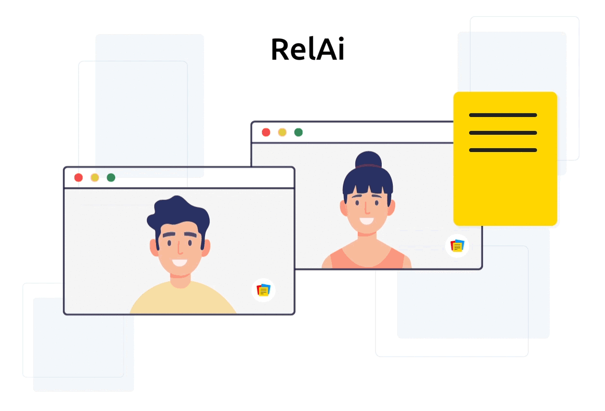

# RelAi 

## Inspiration
Our inspiration came from trying out different virtual meeting platforms ever since most of the world went remote due to Covid-19 and noting down unique features each one hand and what we could add to make meetings a lot more easier. We discovered that instead of having someone watch a whole meet recording, they could choose to read it or just get an idea of what they missed out or if someone is busy with other activities, they can just use voice commands and run meetings.

## What it does
<ul>
<li>With the help of RelAi, a user can upload the meeting data to get a quick summary of the meeting with the help of <b>Expert.ai</b>.</li>
<li>The data can be in any form i.e Video, Audio or Text Documents.</li>
<li>The user can also use the interactive chatbot on the website to schedule an event or view upcoming events.</li>
</ul>

## How we built it
<ul>
<li>We have built our dashboard using ReactJS.</li>
<li>The user can firstly participate or organize a virtual meeting.</li>
<li>Once the user ends a meet, a video file is generated.</li>
<li>This generated file can be used to perform analysis on.</li>
<li>The user can upload a file in any format i.e. text documents, audio, video, etc.</li>
<li>The file is then sent to our backend server which is created using Node.js.</li>
<li>If the file is a <b>text</b> file, we extract the text from the text file and perform summarization on it using the API of Expert.ai.</li>
<li>If the file is a <b>audio</b> file, we extract the text from the audio(.wav) file using our hosted Python scripts and the <b>Houndify API</b>. We then perform summarization on it using the API of Expert.ai.</li>
<li>If the file is a <b>video</b> file, we extract the text from the audio(.mp4) file using our hosted Python scripts and <b>moviepy</b> python package. We then perform summarization on it using the API of Expert.ai.</li>
<li>The user can also use the <b>Chatbot</b> present on the dashboard for creating and retrieving events.</li>
<li>The user has to authenticate himself/herself using <b>Google OAuth</b> and then the backend server can access the Google calendar of the user when a request is made through the chatbot to create or retrieve the event.</li>
<li>The user can then view his events in the calendar section on the dashboard.</li>
</ul>

## Challenges we ran into
<ul>
<li>Creating the meet section. Working with <b>WebRTC</b> and <b>ReactJS</b> was challenging.</li>
<li>Working with <b>Socket.io</b>.</li>
<li>It was challenging to run Python files on our Node.js backend server.</li>
<li>Conversion of video files to text files was challenging.</li>
</ul>

## Accomplishments that we're proud of
<ul>
<li>Learning and understanding how to incorporate WebRTC in the project for the meet section.</li>
<li>Learning how to run Python files on our Node.js backend server.</li>
<li>Understanding how to use Expert.ai's API for text summarization and analysis.</li>
</ul>

## What we learned
<ul>
<li>We learned how to extract key notes from a text using the API of Expert.ai.</li>
<li>We also learned how to create a video conferencing section from scratch using Socket.io and WebRTC.</li>
</ul>

## What's next for RelAi
<ul>
<li>Use better Speech-to-text API's like <b>Google's Speech-to-text</b> API to enhance performance.</li>
<li>Deploy the app for public usage.</li>
</ul>

## Demo video
To watch the app demo on YouTube <a href="https://www.youtube.com/watch?v=cLu8BUyH17w">Click here</a>.

## Team Members

<ul>
  <li><a href="https://github.com/Darlene-Naz">Darlene Nazareth</a></li>
  <li><a href="https://github.com/sherwyn11">Sherwyn D'souza</a></li>
</ul>

## License

[MIT License Link](https://github.com/Darlene-Naz/RelAi/blob/master/LICENSE)
